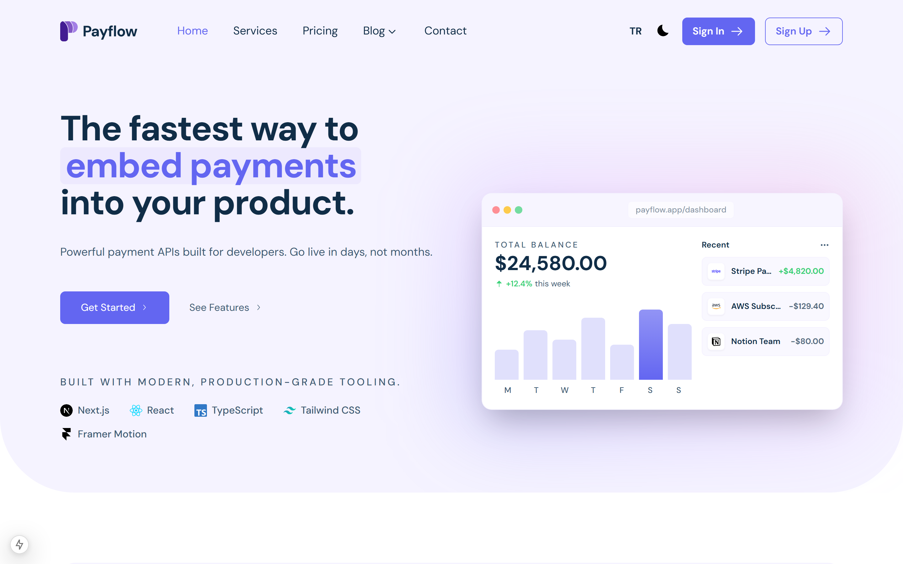

<p align="center">
  
</p>

# Payflow — Payment Infrastructure for Developers

> Embed powerful payment APIs into your product. Build in days, launch in weeks.

[](https://samer-os-payflow.netlify.app)
[](https://github.com/Samer-Os/payflow/actions/workflows/ci.yml)
[](https://nextjs.org)
[](https://playwright.dev)
[](LICENSE)

---

## Stack

| Technology | Rationale |
|---|---|
| **Next.js 16** | App Router for RSC streaming, Suspense, and file-based routing |
| **React 19** | Latest concurrent features, server components, `useDeferredValue` |
| **TypeScript 6** | End-to-end type safety across components and i18n |
| **Tailwind CSS v4** | Utility-first styling with CSS-native `@theme` tokens |
| **lucide-react** | Tree-shakeable icons, no runtime fetching (~1KB per icon) |
| **Reveal/Stagger** | Custom IntersectionObserver hooks (~90 lines, no heavy animation lib) |
| **next-themes** | Zero-flash dark mode toggle via class strategy |

## Features

- **i18n** — Full English / Turkish support via a custom React context (`context/LanguageContext`)
- **Dark mode** — System-aware, toggleable, zero-FOUC via inline `<head>` script
- **Responsive** — Mobile-first grid layouts from 320px to 2xl
- **Animated** — Staggered reveal, count-up, scale & fade transitions; respects `prefers-reduced-motion`
- **Accessible** — Native `<dialog>` modals, skip-to-content, focus-visible rings, WCAG AA contrast
- **Type-safe** — Strict TypeScript, no `any` leaks in public APIs
- **Demo dashboard** — `/dashboard` with RSC + Suspense streaming, filterable transactions table

## Dashboard Demo

Navigate to `/dashboard` (or click **Get Started** on the homepage) to see:

- **Stats grid** streamed via `<Suspense>` with an animated skeleton fallback — the async RSC resolves in ~300 ms to demonstrate streaming
- **Filterable transactions table** built as a client component using `useDeferredValue` for non-blocking search
- **Status filters** (all / completed / pending / failed) and live search across names, IDs, and amounts

## Lighthouse Scores

<p align="center">
  
</p>

Measured via `lighthouse --preset=desktop` against the production build. Performance varies **95–99** depending on system load; Accessibility, Best Practices, and SEO are consistently **100**.

**Core Web Vitals (desktop):**
- **LCP** — 0.9 s
- **CLS** — 0
- **TBT** — 30 ms

Reproduce locally:

```bash
npm run build && npm run start &
npx lighthouse http://localhost:3000 --preset=desktop --view
```

Lighthouse CI also runs automatically in GitHub Actions on every push (`.lighthouserc.json` — performance ≥ 0.85, a11y ≥ 0.95, best-practices = 1.0, SEO = 1.0).

## Scripts

| Script | Description |
|---|---|
| `npm run dev` | Start dev server |
| `npm run build` | Production build |
| `npm run start` | Serve production build |
| `npm run lint` | ESLint (flat config, ESLint 9) |
| `npm test` | Vitest unit tests |
| `npm run test:e2e` | Playwright e2e tests |
| `npm run check` | Run tsc + eslint + vitest concurrently |
| `npm run analyze` | Bundle analyzer (`ANALYZE=true next build`) |

### Bundle analysis

```bash
npm run analyze
# Opens an interactive treemap of every JS chunk
```

## Engineering Decisions

- **RSC split** — Homepage sections (Hero, Benefit, Method, Testimonials, FAQ) are pure async server components. Language is read from a cookie via `cookies()` + `getDictionary()`, so there is no hydration cost for static content. Only interactive sections (Pricing tabs, Header language toggle) ship as client components.
- **Icons over runtime fetchers** — Replaced `@iconify/react` with `lucide-react` and inline SVGs for brand icons. Eliminates network requests and enables tree-shaking.
- **IntersectionObserver over Framer Motion** — Built a lightweight `Reveal`/`Stagger` component (~90 lines) using native IntersectionObserver instead of a 200 KB animation library. Animations respect `prefers-reduced-motion` and use GPU-accelerated CSS transforms.
- **Anti-FOUC script** — Inline script in `<head>` reads `localStorage.theme` before React hydrates, preventing the white flash on dark mode load.
- **Demo auth** — NextAuth is stubbed out entirely. Sign-in and sign-up simulate an 800 ms server round-trip, show a toast, then redirect. No credentials are stored; no secrets are required to run the project locally.
- **CSP header** — A `Content-Security-Policy` is set in `next.config.mjs` for every route, restricting scripts, styles, fonts, images, and connections to known-safe origins.

## Quality Gates

- **Unit tests** — 35 Vitest tests across `LanguageContext` (t() interpolation, fallback, language switch), `Reveal` (IntersectionObserver, reduced-motion), `ContactForm` (submit flow, toast), `PricingClient` (tab a11y), and `ProductMockup` (chart + transactions).
- **Accessibility** — Zero serious or critical axe-core violations across WCAG 2.1 A & AA. Verified by `tests/e2e/a11y.spec.ts`.
- **End-to-end** — Playwright smoke and a11y tests cover dialog focus, language toggle, theme toggle, skip-to-content, and auth forms.
- **Lighthouse CI** — Performance, accessibility, best-practices, and SEO thresholds enforced on every CI run.

## Architecture

```
src/
├── app/                    # Next.js App Router (pages, layout, API routes)
│   ├── (site)/             # Route group for public pages
│   │   └── dashboard/      # Demo dashboard (RSC + Suspense streaming)
│   ├── api/                # Stubbed auth API route
│   ├── context/            # AuthDialog context
│   └── layout.tsx          # Root layout (font, theme, providers)
├── components/
│   ├── Home/               # Section RSCs (Hero, Benefit, Method, Pricing shell, FAQ…)
│   ├── Dashboard/          # DashboardStats (async RSC) + TransactionsClient
│   ├── Layout/             # Header, Footer, Logo
│   ├── Auth/               # SignIn, SignUp, SocialButtons (demo mode)
│   └── Common/             # Reveal, ScrollToTop, shared UI
├── context/
│   └── LanguageContext.tsx  # i18n provider — getDictionary() for RSC, useTranslation() for client
├── locales/
│   ├── en.json             # English translations
│   └── tr.json             # Turkish translations
└── Style/                  # Additional utility CSS
```

## Design System

**Color tokens** — defined in [`src/app/globals.css`](src/app/globals.css) under `@theme`:

| Token | Value | Usage |
|---|---|---|
| `primary` | `#6366f1` | CTAs, links, accents |
| `midnight_text` | `#102d47` | Headings, body text (light) |
| `muted` | `#3d5a73` | Secondary text (WCAG AA compliant) |
| `heroBg` | `#f5f3ff` | Light hero/section backgrounds |
| `darkmode` | `#0d0b1a` | Dark mode body background |
| `border` | `#ede9fe` | Card & input borders (light) |

**Type scale** — 8 semantic tokens from `caption` (0.8125rem) to `display` (3.5rem), each with a tuned line-height.

## Local Development

```bash
# Clone
git clone https://github.com/Samer-Os/payflow.git
cd payflow

# Install
npm install

# Run dev server
npm run dev
# → http://localhost:3000

# Run all checks at once
npm run check

# Production build
npm run build && npm start
```

## License

[MIT](LICENSE) — free for personal and commercial use.
